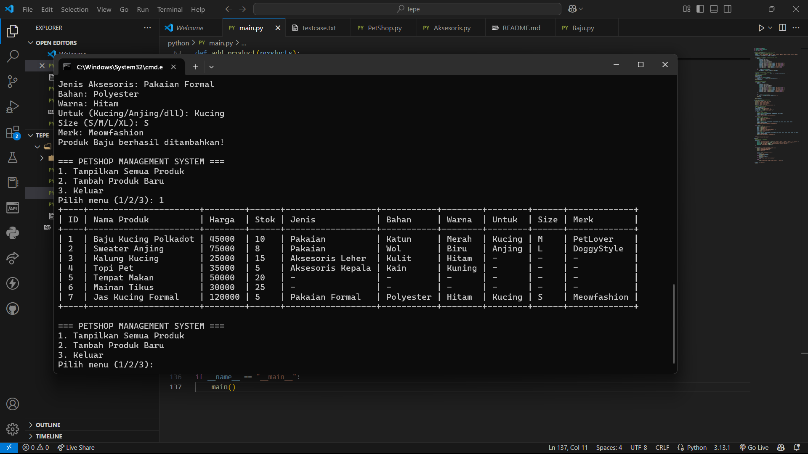
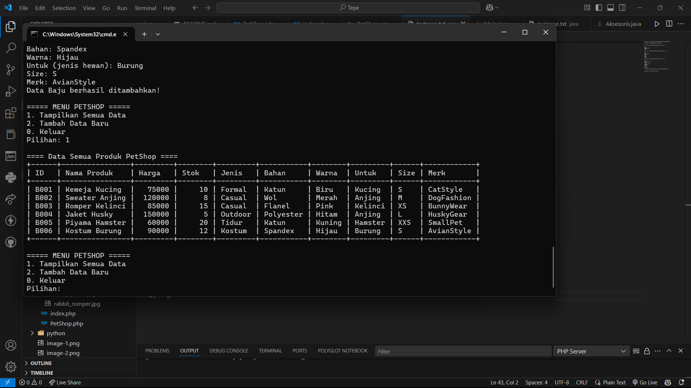
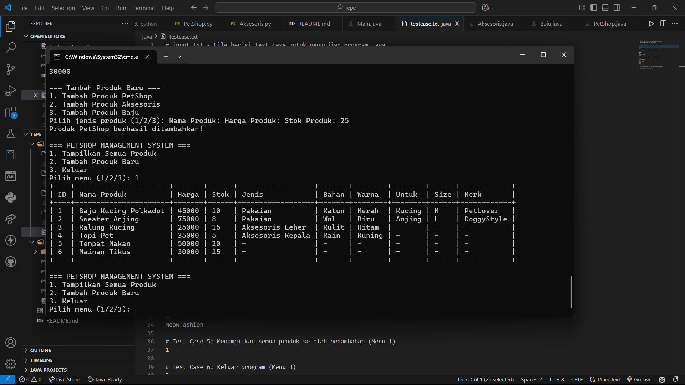
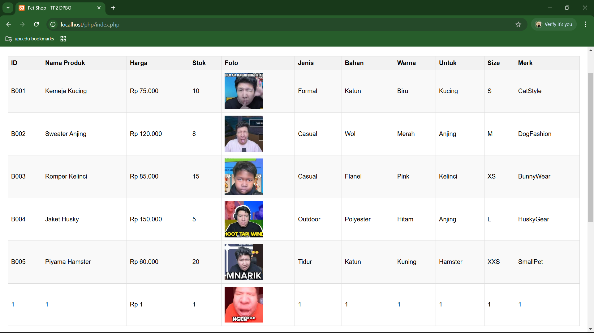

# TP2DPBO2025C2

## Janji
Saya Yattaqi Ahmad Faza dengan NIM 2311216 mengerjakan Tugas Praktikum 2 dalam mata kuliah Desain Pemrograman Berorientasi Objek untuk keberkahanNya maka saya tidak melakukan kecurangan seperti yang telah dispesifikasikan. Aamiin.

## Deskripsi Tugas
Buatlah program berbasis OOP menggunakan bahasa pemrograman C++, Java, Python, dan PHP yang mengimplementasikan konsep Multi-level Inheritance dengan spesifikasi sebagai berikut:

1. Program memiliki 3 level class:
   - **PetShop**: id, nama_produk, harga_produk, stok_produk
   - **Aksesoris**: jenis, bahan, warna (child dari PetShop)
   - **Baju**: untuk, size, merk (child dari Aksesoris)

2. Fitur yang harus ada:
   - Menampilkan seluruh data dalam satu tabel dinamis
   - Menambahkan data baru (minimal ADD)
   - 5 data awal (hardcode)

## Desain Program

### Relasi Antar Class
Program ini mengimplementasikan konsep Multi-level Inheritance dengan struktur sebagai berikut:

```
PetShop (Base/Parent class)
   ↑
Aksesoris (Inherits from PetShop)
   ↑
Baju (Inherits from Aksesoris)
```

### Penjelasan Class

#### Class PetShop
Class dasar yang berisi atribut umum untuk semua produk di pet shop.

**Atribut:**
- `id` - ID unik produk
- `nama_produk` - Nama produk
- `harga_produk` - Harga produk
- `stok_produk` - Jumlah stok produk

**Method:**
- Constructor untuk inisialisasi objek
- Getter dan Setter untuk semua atribut

#### Class Aksesoris (Turunan dari PetShop)
Class yang mewakili produk aksesoris untuk hewan peliharaan.

**Atribut tambahan:**
- `jenis` - Jenis aksesoris (contoh: Aksesoris Leher, Aksesoris Kepala)
- `bahan` - Bahan pembuatan aksesoris
- `warna` - Warna aksesoris

**Method:**
- Constructor (memanggil constructor parent)
- Getter dan Setter untuk atribut tambahan

#### Class Baju (Turunan dari Aksesoris)
Class yang mewakili produk baju/pakaian untuk hewan peliharaan.

**Atribut tambahan:**
- `untuk` - Jenis hewan (contoh: Kucing, Anjing)
- `size` - Ukuran baju (S, M, L, XL)
- `merk` - Merk baju

**Method:**
- Constructor (memanggil constructor parent)
- Getter dan Setter untuk atribut tambahan

## Alur Program

1. Program dimulai dengan menampilkan menu utama:
   - Tampilkan Semua Produk
   - Tambah Produk Baru
   - Keluar

2. Jika user memilih "Tampilkan Semua Produk":
   - Program akan menampilkan semua produk dalam tabel yang dinamis
   - Tabel akan menyesuaikan lebar kolomnya berdasarkan data yang ada

3. Jika user memilih "Tambah Produk Baru":
   - User diminta memilih jenis produk (PetShop, Aksesoris, atau Baju)
   - User memasukkan data sesuai dengan jenis produk yang dipilih
   - Produk baru ditambahkan ke dalam list produk

4. Jika user memilih "Keluar":
   - Program akan berakhir

## Dokumentasi
Python :

Cpp :

Java :

PHP :

